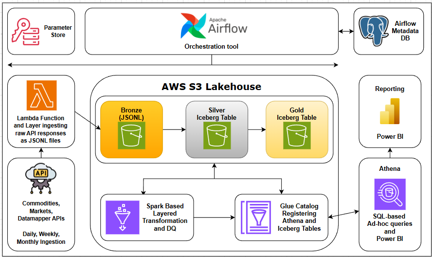
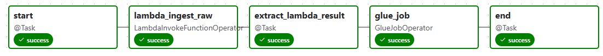
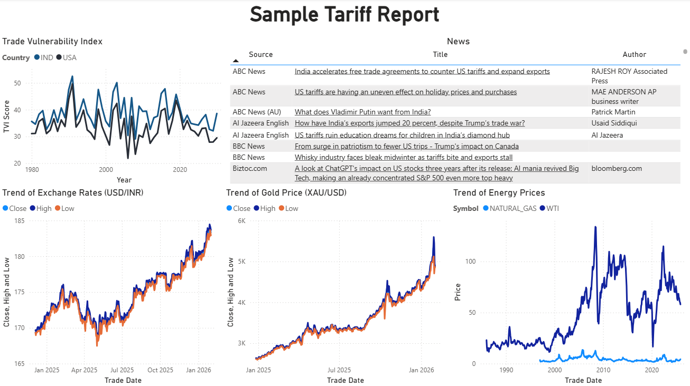

# AWS Tariff Lakehouse Pipeline

This README documents the AWS Tariff Lakehouse Pipeline built with **Apache Airflow**, **AWS S3**, **AWS Lambda**, **AWS Glue (PySpark)**, **AWS Athena**, and **Power BI**.

---

## Table of Contents
1. [Project Overview](#project-overview)
2. [Architecture](#architecture)
3. [Data Contract Details](#data-contract-details)
4. [Repository Layout](#repository-layout)
5. [Airflow DAGs](#airflow-dags)
6. [Lambda](#lambda)
7. [Glue-Spark](#glue-spark)
8. [Incremental & Idempotent Processing](#incremental--idempotent-processing)
9. [Power BI Project](#power-bi-project)
10. [Apache Iceberg](#apache-iceberg)
11. [Running the Project](#running-the-project)
12. [Key Design Decisions](#key-design-decisions)
13. [Future Enhancements](#future-enhancements)
14. [Links](#links)

---

## Project Overview

**Name:** AWS Tariff Lakehouse
**Purpose:** A modern **ELT** pipeline built on AWS lakehouse architecture that ingests and transforms diverse datasets—including macroeconomic indicators, stock prices, commodity spot and futures data, market performance metrics, and tariff-related news articles. The pipeline processes these datasets at varying cadences to analyze the ongoing US tariff situation and its specific impact on India.

**Key Features:**
- **Incremental, idempotent consumption** – Reliable data consumption with no duplication
- **ACID compliance via Apache Iceberg** – Transactional guarantees for data integrity
- **Medallion architecture** – Clear separation of Bronze (raw), Silver (cleansed), and Gold (aggregated) layers

---

## Architecture

**Technologies Used:**
| Layer | Technology | Purpose |
|-----|-----------|--------|
| Orchestration | Apache Airflow | DAG-based scheduling, dependencies, retries |
| Storage | Amazon S3 | Lakehouse storage for all table layers |
| Processing | AWS Glue (Spark) | Distributed and scalable transformations |
| Table Format | Apache Iceberg | ACID tables, schema & partition evolution |
| Catalog | AWS Glue Data Catalog | Table & schema metadata |
| Query Engine | Amazon Athena | Ad-hoc querying & validation |
| Infrastructure | Docker | Local reproducibility |
| Visualization | Power BI | Connects to AWS Athena and queries data from the lakehouse iceberg tables |

**Data Flow:**
```
External APIs / Datasets
        ↓
Lambda Ingestion
        ↓
S3 (Bronze – Raw JSON/CSV)
        ↓
AWS Glue Spark Jobs
        ↓
Iceberg Tables (Silver)
        ↓
Business Logic & SCD2 Merges
        ↓
Iceberg Tables (Gold)
        ↓
Athena / BI / Analytics
```

**Architecture Diagram:**  
<p align="center">
  
</p>

#### Lakehouse Design - Medallion Architecture

**Bronze**
- Raw, append-only data
- Minimal transformations
- Preserves source fidelity
- Partitioned by ingestion date

**Silver**
- Cleaned and standardized data
- Typed schemas
- Deduplicated records
- Incremental processing using SCD2 Merge

**Gold**
- Business-level aggregates
- Metrics and KPIs
- Optimized for analytics

**Links:**
- [DAGs](airflow/dags)
- [Docker Compose File](docker-compose.yml)
- [Custom Glue-Jupyter Image](glue/Dockerfile.livy_jupyter)
- [.env Template for local dev](copy.env)

---

## Data Contract Details

Detailed documentation defining the **data contracts** and **integration patterns** used in the AWS Tariff Lakehouse pipeline, covering the event flow from **Airflow → Lambda → Glue**: [Data Contract](./DataContracts.md)

---

## Repository Layout
[Full Project Structure](docs/file_structure.txt)

```
.
├── airflow/
│   ├── dags/
│   ├── logs/
│   └── utils/
├── athena/
├── glue/
│   ├── notebooks/
│   └── scripts/
├── lambda/
│   ├── functions/
│   └── layer/
|       └── python/
|           ├── lib/
|           └── src/
│               ├── ingestion/
│               └── utils/
├── pbi/
├── docker-compose.yml
└── .env
```

---

## Airflow DAGs

[tariff_dynamic_dag](airflow/dags/tariff_dynamic_dag.py)

The pipeline implements a **configuration-driven dynamic DAG pattern** where each DAG is programmatically generated from a centralized configuration file (`tariff_dags_config.json`). This approach enables scalable, maintainable orchestration across multiple data sources and domains.

**DAG Workflow**

<p align="center">
  
</p>

Each dynamically generated DAG follows a four-stage workflow:

1. **Event Construction** – Builds a structured Lambda invocation payload containing source metadata (`source`, `domain`, `dataset`) and API-specific parameters from the DAG configuration
2. **Lambda Ingestion** – Invokes the configured Lambda function via `LambdaInvokeFunctionOperator` with `RequestResponse` mode, capturing the response in XCom for downstream consumption
3. **Response Validation** – Extracts and validates the Lambda response, ensuring `status == "SUCCESS"` and `record_count > 0`; failures halt the pipeline with explicit error messages
4. **Glue Transformation** – On successful validation, triggers the configured Glue job via `GlueJobOperator`, passing normalized metadata as script arguments (`--DOMAIN`, `--SOURCE`, `--DATASET`, `--KEYS`, etc.)

**Key Design Features**

- **Loose Coupling** – Lambda and Glue jobs are decoupled via contract-based communication (see [Data Contracts](./DataContracts.md))
- **Fail-Fast Validation** – Invalid Lambda responses prevent Glue execution, avoiding wasted compute on bad data
- **Full Lineage** – Airflow metadata (`dag_id`, `run_id`) is propagated through the entire pipeline for end-to-end traceability
- **Idempotent Execution** – Each DAG run processes only the S3 keys returned by its triggering Lambda execution

**DAG Generation Pattern**

A single factory function (`create_tariff_dag`) generates all DAGs by iterating over `tariff_dags_config.json` entries. This eliminates code duplication and ensures consistency across pipelines, enabling new data sources to be onboarded by simply adding a configuration entry.

**Configuration Schema**:
```json
{
  "<pipeline_key>": {
    "dag_id": "string",                      // Unique DAG identifier
    "schedule": "string",                    // Cron expression or preset
    "source": "string",                      
    "domain": "string",                      
    "dataset": "string",                     
    "lambda_function_name": "string",        // AWS Lambda function name
    "glue_job": "string",                    // AWS Glue job name
    "tags": ["string"],                      // Airflow searchability tags
    "api_params": {                          // Source-specific parameters
      "dataset": "string",                   // Optional, used in-lambda function re-routing
      "params": {                            // Nested params
        // ... varies by source
      }
    }
  }
}
```
---

## Lambda
Refer to the document linked here [Lambda.md](./lambda/Lambda.md).

---

## Glue-Spark
Refer to the document linked here [Glue.md](./glue/Glue.md).

---

## Incremental & Idempotent Processing

This project avoids naïve `append-only` patterns.

Key mechanisms:
- **Iceberg MERGE INTO** for upserts
- **SCD Type 2 logic** for dimensional tables
- **Dynamic partition overwrite** where applicable
- **Airflow-controlled execution windows**
- **Re-runnable DAGs with no duplicate data**

Refer to the documentation for [Lambda](./lambda/Lambda.md), [Glue](./glue/Glue.md), and [Data Contracts](./DataContracts.md) on how this has been implemented.

---

## Power BI Project

**Sample Report:**  
<p align="center">
  
</p>

Refer to the document linked here [Power-BI.md](./pbi/Power-BI.md).

---

## Apache Iceberg

Iceberg Open Table Format enables:
- ACID transactions on S3
- Time travel & rollback
- Schema evolution without rewrites
- Hidden partitioning
- Safe concurrent writes

This makes S3 behave like a true analytical warehouse.

---

## Running the Project

### Prerequisites
- Docker & Docker Compose
- AWS account, credentials, and CLI
- Python 3.9+

### Steps
1. Clone the repository
2. Create the necessary python-UV environment for isolated development
3. Configure `.env` with necessary keys and other variables
4. Configure AWS credentials at AWS console and CLI profile
5. Update the [docker-compose](./docker-compose.yml) file and start the Docker containers:
   ```bash
   docker-compose up -d --remove-orphans
   ```
6. Access Airflow UI

   Run the following command to find the admin password
   ```bash
   docker logs airflow > ./service_logs/airflow.log 2>&1
   ```
7. Follow the steps in [AWS Lambda Functions and Layer](./lambda/Lambda.md) to setup the required Lambda Layer and Functions to execute the data ingestion.
8. Follow the steps in [AWS Glue-Spark Jobs](./glue/Glue.md) to setup the required Glue-Spark Script jobs to execute the downstream transforms and create Silver and Gold iceberg tables.
9. Trigger ingestion DAGs to test the E2E functionality of the pipeline.
10. Query results using Athena, check [Power BI Visualization](./pbi/Power-BI.md) to setup the Athena as source to query the lakehouse tables.

---

## Key Design Decisions

- **Iceberg over Delta/Hudi** for easy compatibility with S3, Glue (Compute and Catalog), and Athena
- **Glue over EMR** for operational simplicity and scale of project
- **Athena over Redshift** for cost efficiency and scale of project
- **Airflow over Step Functions** for easy orchestration of multiple pipelines
- **SCD2 at Gold and Silver layer** for analytical correctness

---

## Future Enhancements

- CI/CD for DAG, Lambda, and Glue validation and deployment
- Data quality framework integration, but for now DQ is baked into the Glue jobs
- Terraform-based infrastructure
- Full-fledged BI report on top of Gold tables

---

## Links
- [Project Structure](./docs/file_structure.txt)
- [DBT Project Structure](./docs/dbt_project_structure.txt)
- [Docker Compose](./docker-compose.yml)
- [Airflow DAGs](./airflow/dags)
- [Glue Jobs](./glue/scripts)
- [Lambda](./lambda)
- [GitHub Repo Commits](https://github.com/DhasharadhaReddy22/aws_tariff_lakehouse/commits)